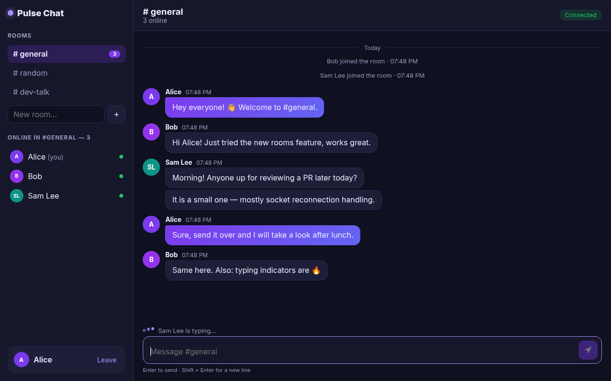
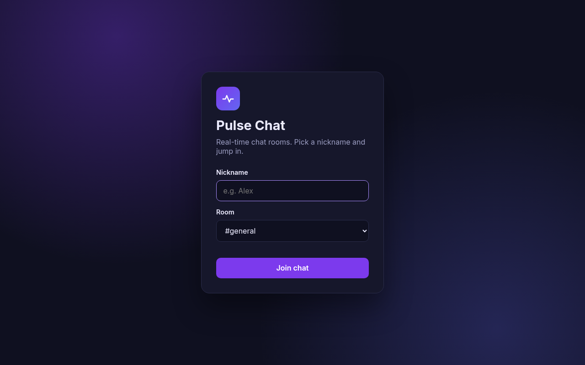
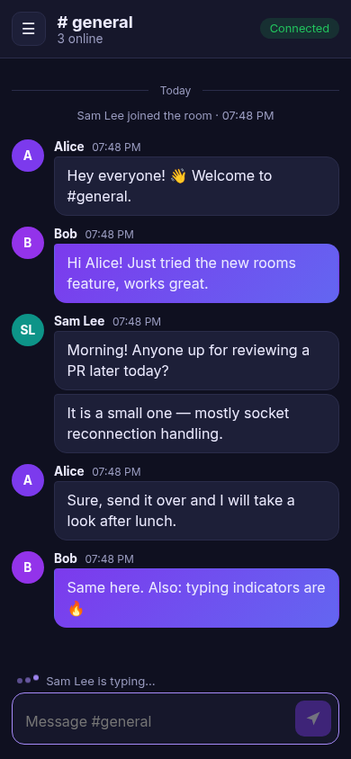
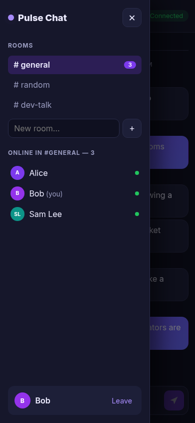

# 💬 Pulse Chat

A real-time chat application with a **Node.js + Express + Socket.IO** server and a **React (Vite)** client. Join a room with a nickname, see who is online, watch others type and pick up the conversation thanks to persisted message history.

> Portfolio project by **Amir Namvar** – full-stack web developer.

---

## ✨ Features

- **Real-time messaging** over WebSockets (Socket.IO) with acknowledgements and server-side validation.
- **Rooms** – three default rooms (`#general`, `#random`, `#dev-talk`) plus user-created rooms; switch rooms without reconnecting.
- **Nicknames** – validated (2–20 characters) and unique per room (case-insensitive); remembered in `localStorage`.
- **Online users** – live list of people in the current room and online counters for every room.
- **Typing indicator** – "Alice is typing…", "Alice and Bob are typing…", debounced on the client.
- **Message history** – last 100 messages per room kept in memory and persisted to a JSON file (debounced, atomic writes), so new joiners and server restarts keep the conversation.
- **Join / leave notices**, day separators, grouped consecutive messages, coloured avatars with initials.
- **Resilient** – connection status badge and automatic re-join after a dropped connection.
- **Responsive** – sidebar becomes a slide-in drawer on mobile; Enter to send, Shift + Enter for a new line.
- **Production mode** – the Express server can serve the built React app, so one process runs everything.
- **Tests** – Socket.IO integration tests with Node's built-in test runner.

## 🛠 Tech Stack

| Layer    | Technology |
|----------|------------|
| Frontend | React 19, Vite 7, socket.io-client, plain CSS |
| Backend  | Node.js 20+, Express 5, Socket.IO 4 |
| Storage  | In-memory per-room history persisted to `server/data/history.json` |
| Testing  | `node:test` + `socket.io-client` |

## 📸 Screenshots

| Chat (desktop) | Join screen |
|----------------|-------------|
|  |  |

| Mobile | Mobile – rooms & users drawer |
|--------|-------------------------------|
|  |  |

## 🚀 Getting Started

### Prerequisites

- **Node.js** 20.19+ (or 22.12+) and npm

### 1. Clone the repository

```bash
git clone https://github.com/som-info/pulse-chat.git
cd pulse-chat
```

### 2. Start the server

```bash
cd server
npm install
npm run dev          # http://localhost:4100
```

Run the tests:

```bash
npm test
```

### 3. Start the client

In a second terminal:

```bash
cd client
npm install
npm run dev          # http://localhost:5173
```

Vite proxies `/api` and the `/socket.io` WebSocket to `http://localhost:4100`. Open the app in two browser windows (or one normal + one private window) to chat with yourself.

### Production

```bash
cd client && npm run build      # creates client/dist
cd ../server && npm start       # serves the API, WebSocket and built client on :4100
```

If the client is hosted on another origin, set `VITE_SERVER_URL` (see `client/.env.example`) and add that origin to `CLIENT_ORIGIN` on the server.

### Environment variables (server)

| Variable        | Default                 | Description |
|-----------------|-------------------------|-------------|
| `PORT`          | `4100`                  | HTTP / WebSocket port |
| `CLIENT_ORIGIN` | `http://localhost:5173` | Allowed CORS origin(s), comma-separated |
| `HISTORY_FILE`  | `data/history.json`     | JSON file for message history. Set to an empty string for memory-only history |
| `HISTORY_LIMIT` | `100`                   | Messages kept per room |

## 🔌 Socket.IO Events

| Direction | Event      | Payload | Description |
|-----------|------------|---------|-------------|
| client → server | `join`    | `{ nickname, room }` + ack | Join (or switch to) a room. Ack: `{ ok, user, room, history, users, rooms }` or `{ error }` |
| client → server | `message` | `{ text }` + ack | Send a message (max 1000 chars) |
| client → server | `typing`  | `true \| false` | Start / stop typing |
| client → server | `leave`   | – | Leave the current room |
| server → client | `message` | message object | New user or system message in your room |
| server → client | `users`   | `[{ id, nickname }]` | Online users in your room |
| server → client | `typing`  | `{ nickname, isTyping }` | Someone in your room started / stopped typing |
| server → client | `rooms`   | `[{ name, online, isDefault }]` | Room list with online counts |

REST helpers: `GET /api/health`, `GET /api/rooms`, `GET /api/rooms/:room/messages`.

## 📁 Project Structure

```
pulse-chat/
├── client/                      # React frontend
│   ├── src/
│   │   ├── components/          # JoinScreen, Sidebar, MessageList, Composer, TypingIndicator, Avatar
│   │   ├── App.jsx              # socket state & event wiring
│   │   ├── socket.js            # socket.io-client instance + ack helper
│   │   ├── utils.js             # avatar colours, time formatting
│   │   ├── index.css
│   │   └── main.jsx
│   ├── index.html
│   ├── package.json
│   └── vite.config.js
├── server/                      # Express + Socket.IO server
│   ├── src/
│   │   ├── app.js               # HTTP routes and socket handlers
│   │   ├── history.js           # per-room history with JSON persistence
│   │   ├── validate.js          # nickname / room / message validation
│   │   ├── config.js
│   │   └── index.js             # entry point
│   ├── tests/chat.test.js
│   ├── data/                    # runtime history file (git-ignored)
│   ├── .env.example
│   └── package.json
├── docs/screenshots/
├── LICENSE
└── README.md
```

## 🗺 Possible Improvements

- Direct messages and message reactions
- Redis adapter for running several server instances
- Database storage (PostgreSQL / MongoDB) and paginated history loading
- Optional accounts and avatars

## 📄 License

This project is licensed under the [MIT License](LICENSE).

---

Made with ❤️ by [Amir Namvar](https://github.com/som-info)
